# 🌿 wallppuccin

A curated collection of wallpapers converted to the **Catppuccin Mocha** color palette.

## 🌌 Why Mocha?
Mocha is the darkest flavor of Catppuccin Mocha, designed for a cozy, high-contrast yet soft aesthetic. This repository aims to be the go-to place for Mocha lovers.

### 🖼️ Wallpapers Gallery (Mocha)

| | | |
| :---: | :---: | :---: |
|  |  |  |
|  |  |  |
| <a href="wallpapers/Anime-Girl4.png">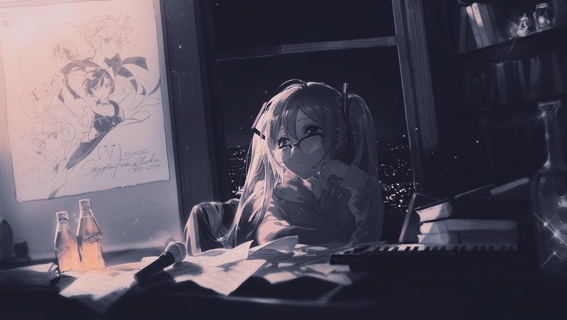</a> |  |  |
|  | <a href="wallpapers/Arch-chan_to.png">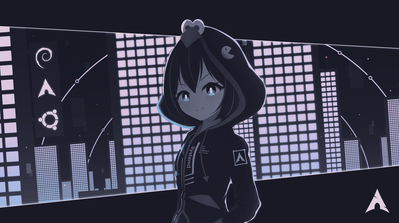</a> | <a href="wallpapers/catppuccin.png">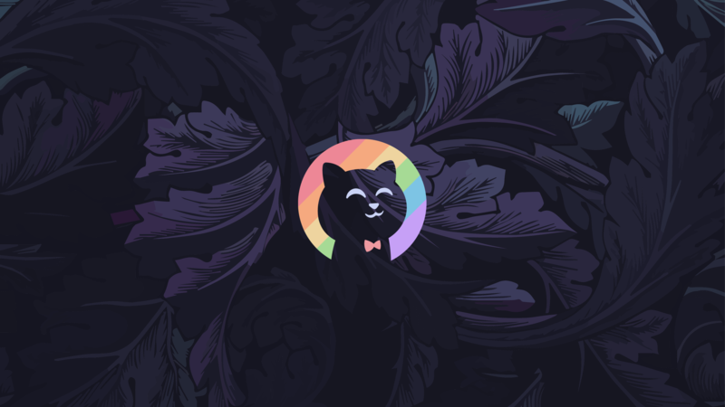</a> |
|  |  |  |
| <a href="wallpapers/in335-wallpaper.cam.jpg">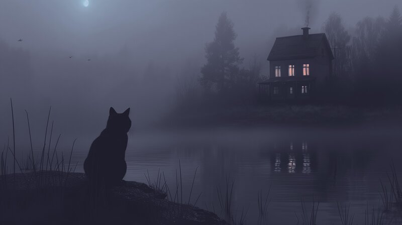</a> | <a href="wallpapers/kitty-catppuccin.png">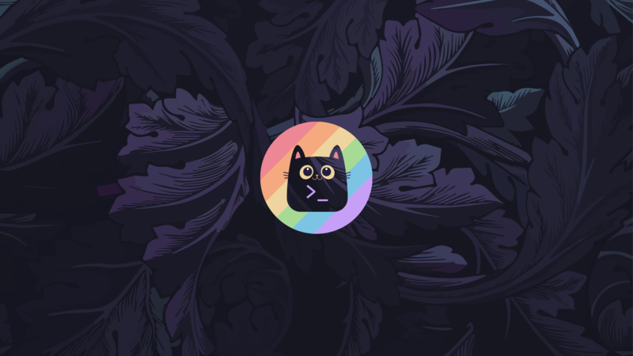</a> |  |
|  | <a href="wallpapers/Lowpoly_Street.png">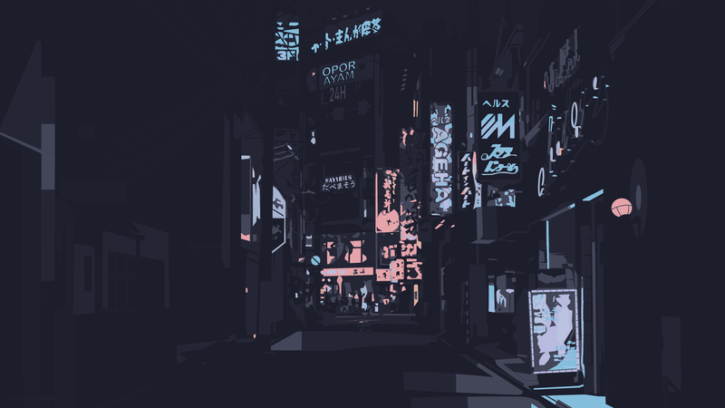</a> | <a href="wallpapers/space-floating.jpg">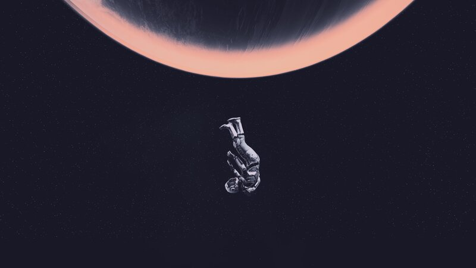</a> |
| <a href="wallpapers/Street-1.png">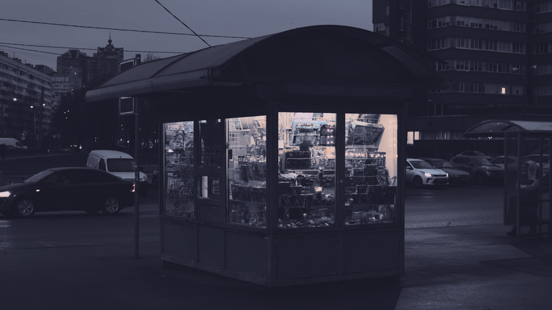</a> | <a href="wallpapers/Street-2.png">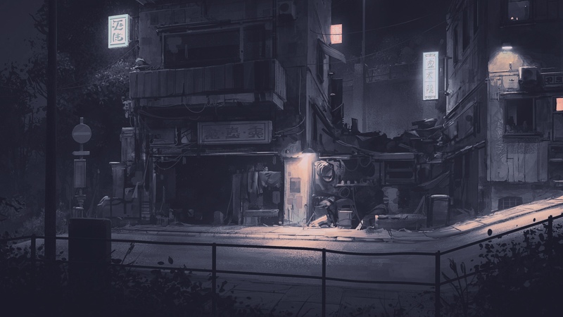</a> |  |
|  |  |  |
| <a href="wallpapers/wallhaven-1p5mqv.jpg">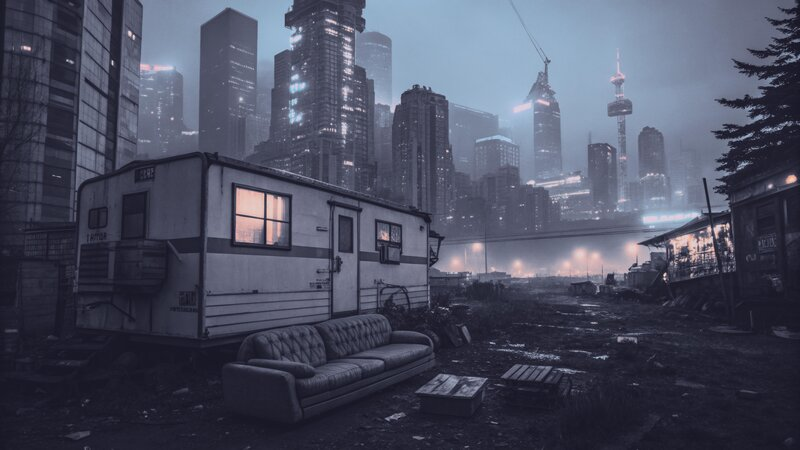</a> |  | <a href="wallpapers/wallhaven-1qq9y1.png">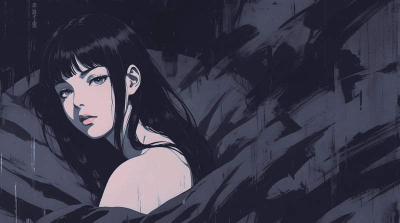</a> |
|  |  |  |
|  | <a href="wallpapers/wallhaven-5yy2o8.png">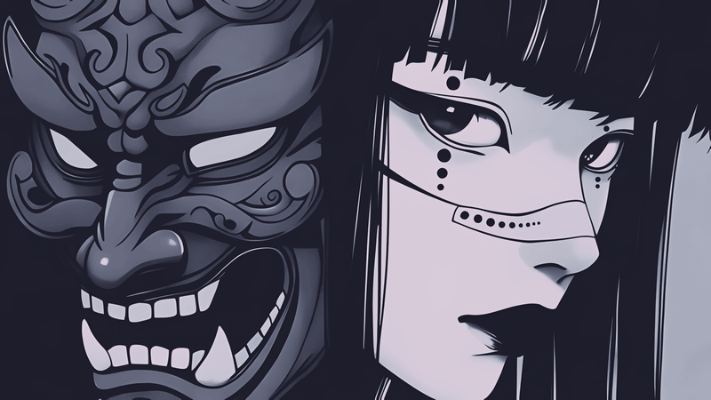</a> | <a href="wallpapers/wallhaven-7j6k53.jpg">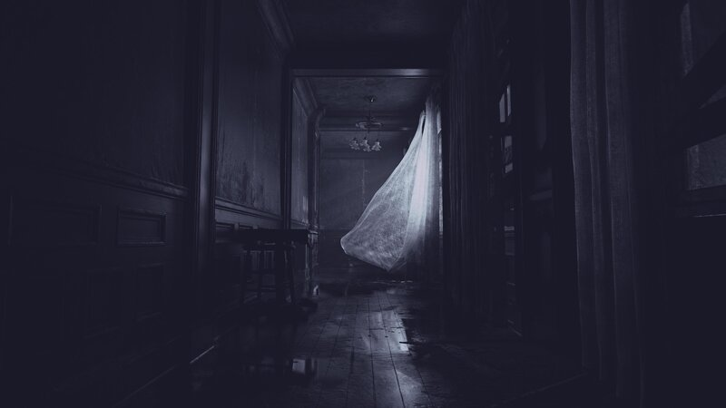</a> |
|  |  |  |
|  |  |  |
|  |  |  |
| <a href="wallpapers/wallhaven-3q9qky.png">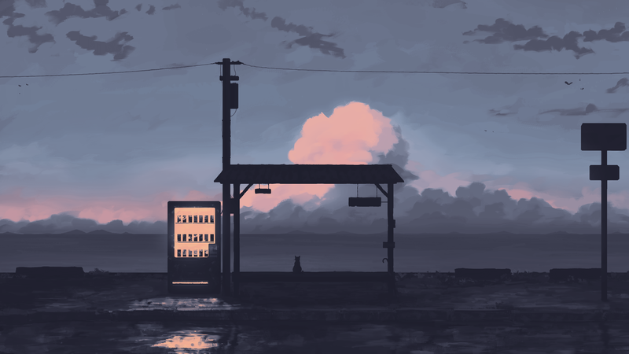</a> |  |  |
|  |  |  |
| <a href="wallpapers/wallhaven-d883yg.png">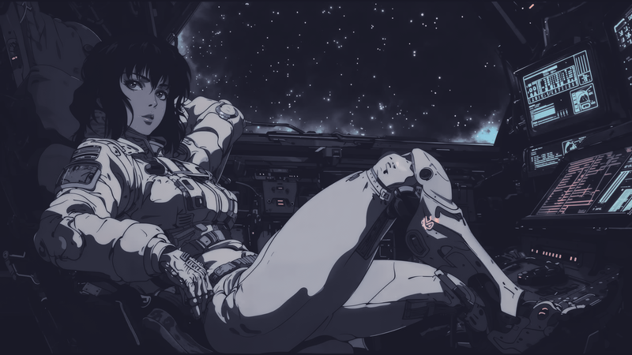</a> |  |  |
| <a href="wallpapers/wallhaven-gp3oll.png">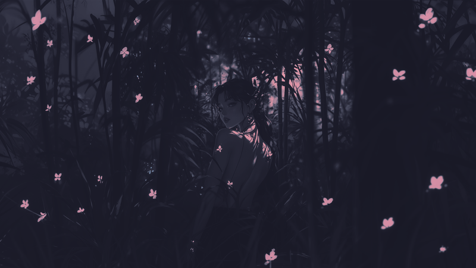</a> |  | <a href="wallpapers/wallhaven-gpo8p3.jpg">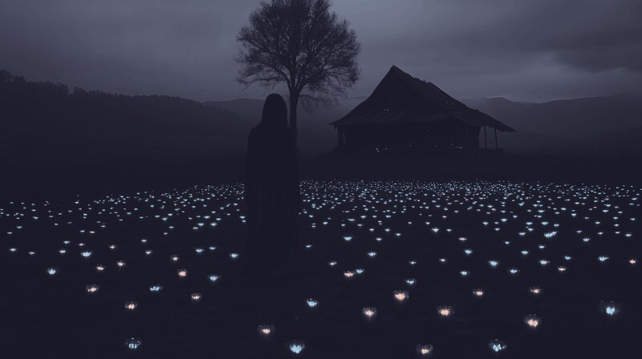</a> |
|  |  |  |
| <a href="wallpapers/wallhaven-kxo68q.jpg">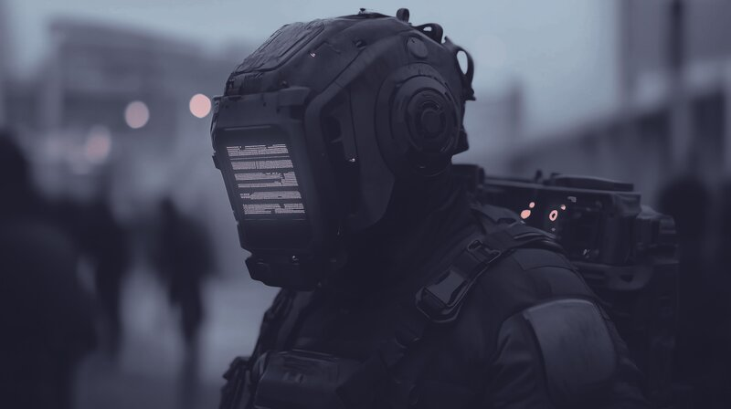</a> |  |  |
|  |  | <a href="wallpapers/wallhaven-m3kggk_3840x2160.png">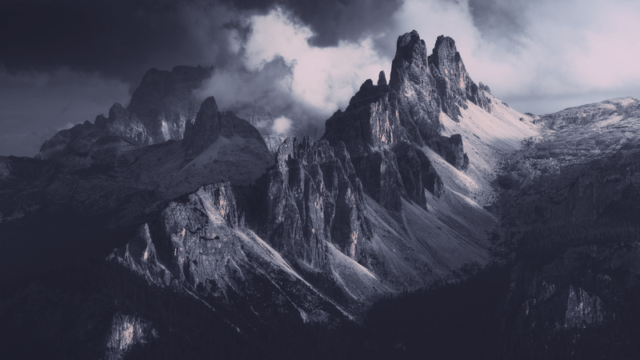</a> |
|  |  | <a href="wallpapers/wallhaven-o5pegl.jpg">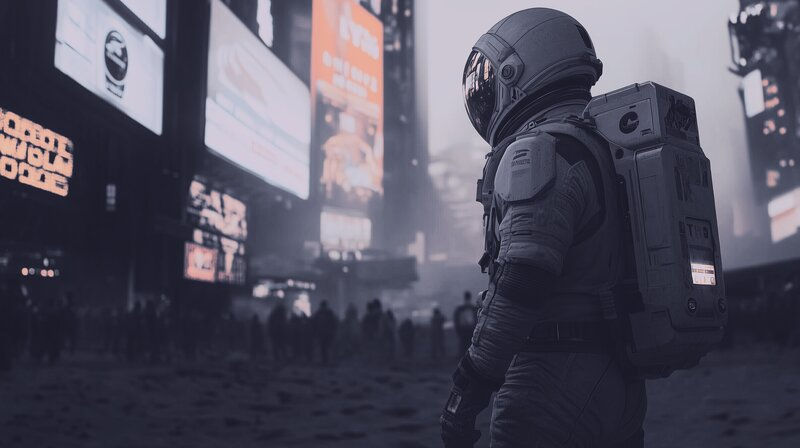</a> |
|  | <a href="wallpapers/wallhaven-ogd2e5.png">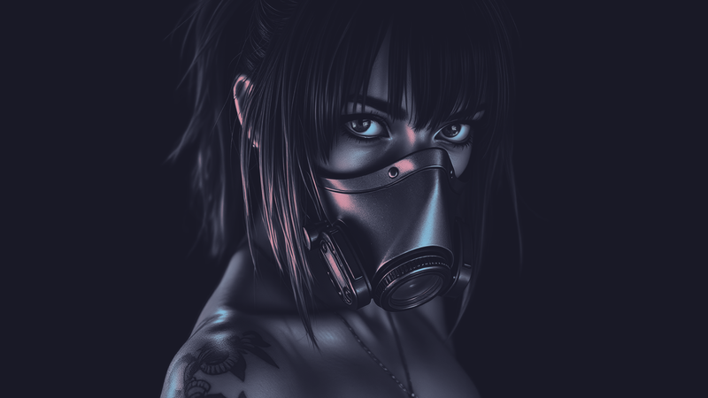</a> |  |
|  |  |  |
|  | <a href="wallpapers/wallhaven-we98vp_3840x2160.png">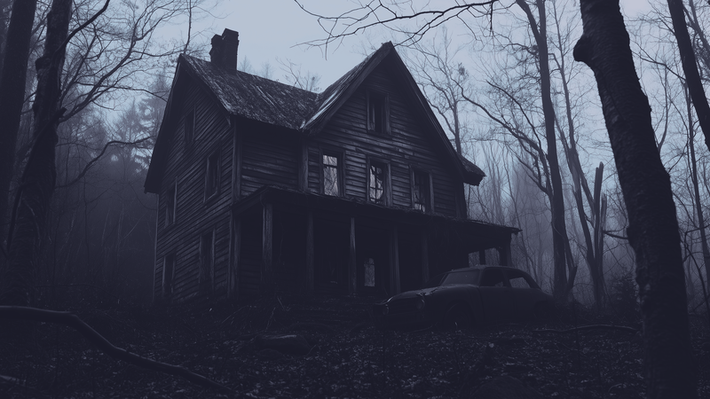</a> |  |
|  |  |  |
| <a href="wallpapers/wallhaven-zpp6zg.jpg">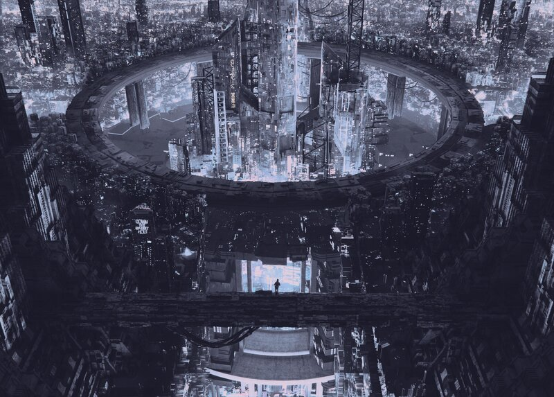</a> | <a href="wallpapers/Wet-Road.jpg">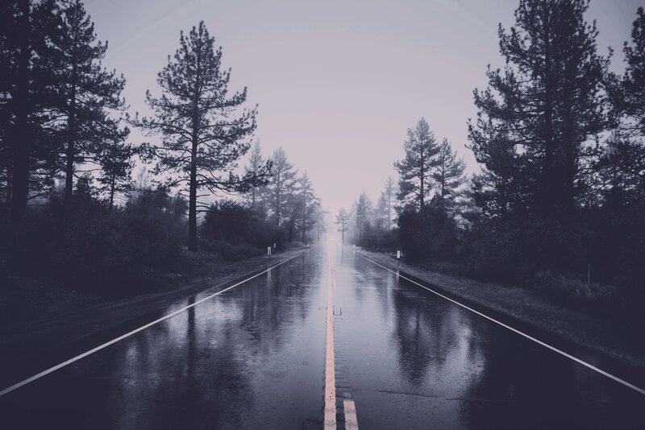</a> | <a href="wallpapers/wallhaven-ogdzd5.png">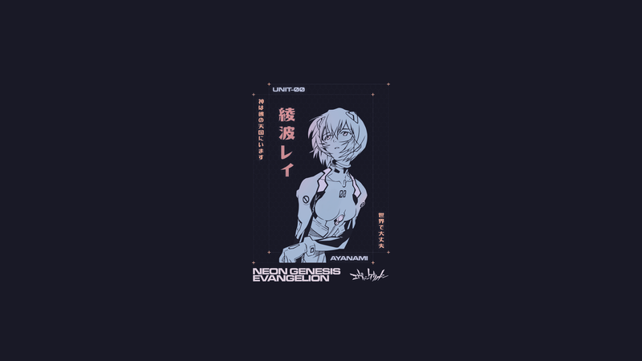</a>|

## 🛠️ Conversion Details
All images are processed to match the Catppuccin Mocha Palette hex codes:
| Preview | Color Name | Hex |
| :---: | :--- | :--- |
|  | **Rosewater** | `#F5E0DC` |
|  | **Flamingo** | `#F2CDCD` |
|  | **Pink** | `#F5C2E7` |
|  | **Mauve** | `#CBA6F7` |
|  | **Red** | `#F38BA8` |
|  | **Peach** | `#FAB387` |
|  | **Yellow** | `#F9E2AF` |
|  | **Green** | `#A6E3A1` |
|  | **Teal** | `#94E2D5` |
|  | **Sky** | `#89DCEB` |
|  | **Blue** | `#89B4FA` |
|  | **Lavender** | `#B4BEFE` |
|  | **Text** | `#CDD6F4` |
|  | **Base** | `#1E1E2E` |
|  | **Mantle** | `#181825` |
|  | **Crust** | `#11111B` |

## 🔗 Credits
- Colors by [Catppuccin](https://github.com/catppuccin/catppuccin).
- Original images from [Wallhaven](https://wallhaven.cc).
